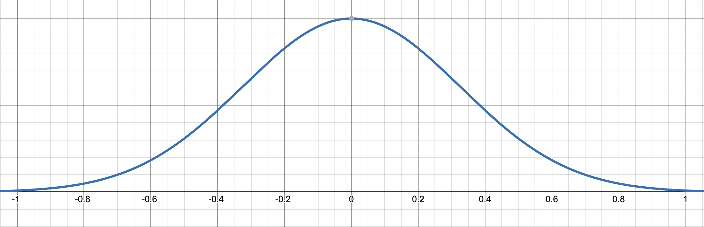

## Explaining Head-To-Head Matchup Scores

The head-to-head matchup scores in this program quantify how a team's offense is expected to perform against their opponent's defense, on a standardized [-1, 1] scale. These appear throughout the output in contexts such as overall efficiency, 2-pointers, 3-pointers, free throws, turnovers, and rebounding.

This scoring system allows for quick, intuitive interpretation of how well (or poorly) one team is expected to fare in a specific statistical area during the matchup.

### What are they?

Here are some examples of where offense vs defense head-to-head matchup scores are present in the output:

```
HEAD TO HEAD MATCHUP
OFFENSE VS DEFENSE (Closer to -1: Disadvantage, Closer to 0: Even, Closer to 1: Advantage)
Houston:     0.58    SIU Edwardsville: -0.47
```

```
HEAD TO HEAD MATCHUP
OFFENSE VS DEFENSE 3PT SCORE (Closer to -1: Disadvantage, Closer to 0: Even, Closer to 1: Advantage)
Duke:        0.81    Mississippi St.: 0.28
```

```
HEAD TO HEAD MATCHUP
OFFENSE VS DEFENSE TURNOVER PERCENTAGE (Closer to -1: Disadvantage, Closer to 0: Even, Closer to 1: Advantage)
Memphis:     -0.03    Colorado St.: -0.07
```

```
HEAD TO HEAD MATCHUP
OFFENSIVE VS DEFENSIVE REBOUNDING (Closer to -1: Disadvantage, Closer to 0: Even, Closer to 1: Advantage)
Florida:     0.47    Houston:     0.37
```

All of these scores represent how well that team's OFFENSE fares against the opposing team's DEFENSE (So if you were wondering how a team's defense matched up with the opposing offense, you could look at the opponent's score to get an idea).

As it is labelled:

    The closer a score is to 1, the bigger the offensive advantage that team has; the offense will very likely thrive in that aspect.
    
    The closer a score is to 0, the better the teams match up in that aspect; neither the offense nor the opposing defense have a particular edge.
    
    The closer a score is to -1, the bigger the advantage for the defense; the offense will very likely struggle in that aspect.
    


### How are they calculated?

First, it must be determined what is the best case scenario for a team.

For example, if we are talking offensive vs defensive efficiency for Team A vs Team B, we would want:

    High Team A Offensive Efficiency (elite offense), High Team B Defensive Efficiency (poor defense)
    
Another example:

    High Team A 3pt Offense (3PT% * 3PTR * tempo * (1-TOV%)(elite 3pt production), High Team B 3pt Defense (3PT%D * 3PTRD * tempo * (1-TOV%D) (poor 3pt defense)
    
In most categories, a high offensive value and high defensive value represent elite offense vs poor defense, which is a favorable matchup for the offense. One instance where the opposite is true, however, would be:

    High Team A Offensive Rebounding % (elite offensive rebounding), Low Team B Defensive Rebounding % (poor defensive rebounding)
    


In the example where it is optimal to have a high Team A stat and a high Team B stat, we would multiply them in a log function like:

    matchup = ln(TeamA_Offense * TeamB_Defense)
    
This will return some number that represents the relation between the offense and defensive metrics.

To normalize this number to the rest of the data, we first need to find the best and worst possible outcomes:

    best = ln(offense_max * defense_max)
    worst = ln(offense_min * defense_min)
    
Next, we normalize the original number we got from measuring Team A's offense against Team B's defense:

    matchup_normalized = (matchup - worst) / (best - worst)
    
This will give us a number on a [0,1] scale that represents where our particular matchup compares to the rest of the possible matchups.

The last step is to scale this number to a [-1,1] scale, to better give an idea if teams have an advantage, a disadvantage, or are evenly matched. To do this, we simply:

    matchup_scaled = 2 * matchup_normalized - 1
    
We now have a numeric representation of how Team A's offense matches up with Team B's defense.

**Keep in mind:** This process is repeated **SEPARATELY** for both teams, so depending on the matchup both offenses could appear dominant against the opposing defense and vice versa.

For instance, if the **BEST** offensive team played the **WORST** defensive team, their head-to-head matchup score would be 1.
On the other hand, if the **WORST** offensive team played the **BEST** defensive team, their head-to-head matchup score would be -1.
If the **BEST** offensive team played the **BEST** defensive team, their matchup score would be 0, both teams being evenly matched.


In the example where where it is optimal to have a high Team A offensive stat and a low Team B defensive stat, we would simply divide them in the log functions like:

    matchup = ln(TeamA_Offense / TeamB_Defense)
    
    best = ln(offense_max / defense_min)
    worst = ln(offense_min / defense_max)
    
And then we carry on with business as usual:

    matchup_normalized = (matchup - worst) / (best - worst)
    
    matchup_scaled = 2 * matchup_normalized - 1
    


## How to interpret these numbers

Each statistic plays out slightly differently, but from what I have seen the numbers mostly seem to be distributed like this:



I find that most of the time, scores will fall into the [-0.5,0.5] range, which makes sense because it is pretty rare that the best team at something will play the worst, especially after the first round. Most of the extreme scores you will see (> 0.8 or < -0.8) will usually come when it is a very unevenly matched game, such as a 1 vs 16 or 2 vs 15.

My general rule of thumb is for something to be truly significant in a head-to-head matchup score, there should be a difference of ~0.2 or more between the 2 teams' scores, however it is always up for different interpretations. Sure, if there is a 0.12 difference then one team might have a slight edge inn that category, but most likely not enough to change the outcome of the game.
    


